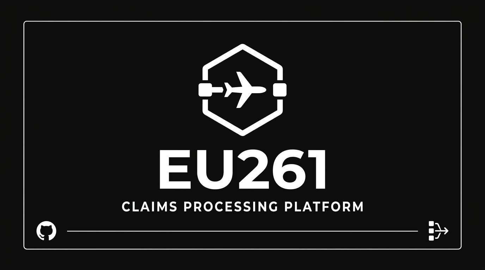

> Built during **Hamburg Hackathon: Innovate the Skies & Beyond** by [Social Developers Club](https://socialdevelopersclub.de/)

# EU261 Claims Processing Platform

A web-based claims management tool for processing airline passenger compensation requests under EU Regulation 261/2004. Built for Lufthansa Customer Relations agents to move from unstructured email inboxes to a structured, verifiable workflow.

## What it does

Agents receive raw passenger emails describing flight disruptions. This platform automates the tedious parts — pulling out flight details, cross-referencing actual operations data, and calculating statutory compensation entitlements — so agents can focus on judgment calls rather than data entry.

The flow is:

1. Select a claim from the queue
2. Run the email through Gemini to extract the flight number, date, and disruption type
3. Query the Lufthansa Operations API to get actual departure/arrival times
4. The system calculates EU261 eligibility and the correct compensation band
5. Approve or reject, edit the pre-filled reply if needed, and resolve

Claims auto-advance to the next pending case on resolution.

## EU261 logic

- Arrival delay >= 3 hours: eligible, up to €600
- Cancellation: eligible, up to €600
- Delay < 3 hours: not eligible

Compensation amounts follow the regulation's distance-based tiers. The verify endpoint applies these rules against actual flight data and returns a verdict with the applicable amount.

## Stack

- SvelteKit 2 / Svelte 5 (runes)
- Tailwind CSS v4
- Vercel AI SDK with Gemini Flash 2.0 (`generateObject` + Zod schema)
- Lufthansa Public API (Operations endpoint)

## Setup

```bash
pnpm install
```

Create a `.env` file:

```
GOOGLE_GENERATIVE_AI_API_KEY=
LH_CLIENT_ID=
LH_CLIENT_SECRET=
```

Both the Lufthansa credentials and the Gemini key are optional for local development. Without Lufthansa credentials the verify endpoint falls back to realistic mock flight data. Without the Gemini key the parse endpoint will fail.

Lufthansa API access: https://developer.lufthansa.com

```bash
pnpm dev
```

## Seeding claims

The app ships with static mock claims. To generate a fresh set from real Lufthansa flight data (requires API credentials):

```bash
npx tsx scripts/seed-claims.ts
```

This scans the six main Lufthansa hubs over a 72-hour window, filters for EU261-eligible disruptions, and writes `src/lib/seededClaims.json`. The load function picks this file up automatically on next start.

## Building

```bash
pnpm build
pnpm preview
```
